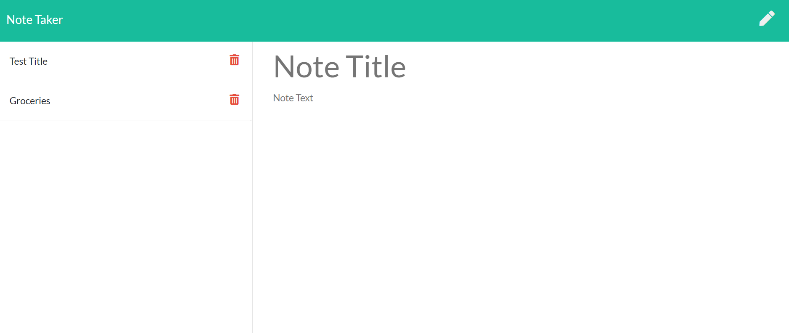

# Note-Taker

Homepage

Notes Listed

Item details

# Description: 
 Express App (Add, Save, Delete, List notes). This app can be used to write, save, and delete notes. This application uses an express backend and save and retrieve note data from a JSON file.
 
 # User Story
AS A user, I want to be able to write and save notes
I WANT to be able to delete notes I've written before
SO THAT I can organize my thoughts and keep track of tasks I need to complete

# Business Context
For users that need to keep track of a lot of information, it's easy to forget or be unable to recall something important. Being able to take persistent notes allows users to have written information available when needed.
 
 # Run: 
 Runs in localhost:8080 in your browser. Press Notes button to begin.

# Hosted 
In Heroku at: https://vast-thicket-98696.herokuapp.com/ 

# Installation: 
'npm install' & and then 'node server.js'
